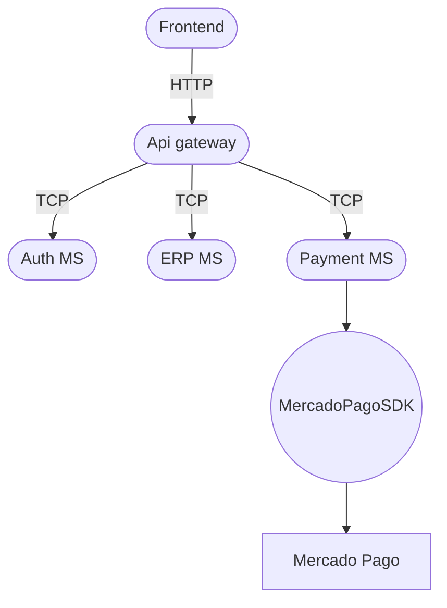

# Trabajo Final - ERP para pymes

## Informacion (Grupo 148)

**Integrantes**

- Lautaro Zullo
- Lucas Gragera
- Galo Coria Maiorano

**Profesor**

- Sebastian Bruselario

26 de Agosto de 2026

## Índice

 [Documentación](#documentación)
   - [Información inicial](#información-inicial)
     - [Problema a Resolver](#problema-a-resolver)
     - [Solución Propuesta](#solución-propuesta)
     - [ERPs de Referencia](#erps-de-referencia)
   - [Arquitectura del Backend](#arquitectura-del-backend)
     - [Microservicios Propuestos](#microservicios-propuestos)
     - [Estructura Interna y Capas](#estructura-interna-y-capas)
     - [Persistencia de Datos y ORM](#persistencia-de-datos-y-orm)
     - [Microservicio Auth](#microservicio-auth)
     - [Pasarela de pagos](#pasarela-de-pagos)
   - [Arquitectura del Frontend](#arquitectura-del-frontend)
     - [Módulos Propuestos](#módulos-propuestos)

---

## Documentación

### Información inicial

#### Problema a Resolver

La fragmentación operativa en pequeños comercios y PyMEs genera cuellos de botella significativos en su gestión diaria. La carencia de un sistema unificado para el control de stock de productos, el registro concurrente de ventas y la emisión de comprobantes de pago resulta en inconsistencias de stock, pérdida de tiempo productivo en tareas manuales y una visibilidad financiera deficiente, lo que obstaculiza la toma de decisiones estratégicas.

#### Solución Propuesta

Desarrollo e implementación de una plataforma web integral (ERP) orientada a la gestión empresarial. Este sistema centralizará la administración del stock de productos, la operatoria de punto de venta (POS) y la analítica financiera, proporcionando una herramienta robusta, escalable y con procesamiento en tiempo real para optimizar los flujos de trabajo del negocio.

#### ERPs de Referencia

- Tango Software
- Contabilium
- Xubio

### Arquitectura del Backend

Para la implementación del backend, se seleccionó NestJS debido a la flexibilidad y facilidad que ofrece para estructurar una arquitectura orientada a microservicios.

> Link a documentación oficial NestJS: <https://docs.nestjs.com/>

#### Microservicios Propuestos

La aplicación se dividirá en los siguientes servicios independientes:

- **ERP Microservice**: Gestión del núcleo del sistema y stock de productos.
- **Auth Microservice**: Control de autenticación, autorización y usuarios.
- **Payments Microservice**: Procesamiento y gestión de pagos.

Estos microservicios mantendrán comunicación interna mediante el protocolo TCP y se expondrán hacia el exterior a través de una API con un Client Gateway. La comunicación TCP interna contribuye al aislamiento de los microservicios y reduce la superficie de exposición. El objetivo es que solo el Gateway tenga acceso al exterior; de esta forma, el resto de microservicios se encuentran dentro de una red privada de Docker.

> Link a documentación de Microservicios con NestJS: <https://docs.nestjs.com/microservices/basics>

#### Estructura Interna y Capas

Cada servicio adoptará una arquitectura en capas organizada de la siguiente manera:

- **Controladores (Controllers)**: Encargados de recibir y responder las peticiones externas.
- **Servicios (Services)**: Responsables de procesar la lógica de negocio correspondiente a cada módulo.
- **Repositorios (Repositories)**: Destinados a gestionar la interacción y consultas con la base de datos.

#### Persistencia de Datos y ORM

Como motor de base de datos se seleccionó PostgreSQL, priorizado sobre MySQL por su excelente compatibilidad con las herramientas del ecosistema. Este motor relacional facilitará la estructuración de los productos y una mejor organización general. La interacción entre NestJS y la base de datos se llevará a cabo mediante el ORM Prisma, elegido por su integración nativa con el framework y la familiaridad previa del equipo con esta herramienta.

> Link a la documentación prisma-postgreSQL: <https://www.prisma.io/docs/prisma-orm/quickstart/prisma-postgres>

#### Microservicio Auth

Para el registro e inicio de sesión de los usuarios en la aplicación, se implementará un sistema de autenticación tradicional mediante usuario y contraseña. Asimismo, el control y la gestión de las sesiones activas se llevarán a cabo mediante el uso de tokens JWT (JSON Web Tokens).

#### Pasarela de pagos

Para la pasarela de pagos vamos a utilizar el SDK de Mercado Pago. Creemos que nos conviene usar el SDK oficial de Node.js en el Payment Service en lugar de implementar manualmente todas las llamadas HTTP a la API. En la documentación oficial indica que Mercado Pago tiene un SDK server-side para Node.js y que el backend se autentica mediante el Access Token privado de la aplicación.

> Link a la documentación de MercadoPagoSDK: <https://www.mercadopago.com.ar/developers/es/docs/sdks-library/overview>

### Arquitectura del Frontend

Para el desarrollo de la interfaz de usuario (frontend), optamos por Angular dada su solidez, arquitectura estructurada y las facilidades que brinda para la construcción de aplicaciones. Asimismo, la organización modular de Angular comparte una filosofía de trabajo muy similar a la de NestJS, lo que consideramos clave para acelerar y optimizar el proceso de desarrollo.

> Link a la documentación oficial de Angular: <https://angular.dev/overview>

#### Módulos Propuestos

La arquitectura cliente se estructurará a través de los siguientes módulos independientes:

- **Módulo Core y Auth**: Encargado del control de acceso, la administración de sesiones, roles de usuario y la protección de rutas.
- **Módulo de Inventario**: Diseñado para la gestión y consulta del catálogo mediante tablas de stock dinámicas e interactivas.
- **Módulo de Ventas y Pagos**: Orientado al procesamiento de transacciones, la administración del carrito de compras y los cobros a través de formularios reactivos.

Para optimizar el rendimiento y la velocidad de carga de la aplicación web, se implementará la técnica de lazy loading (carga diferida). De este modo, los módulos no se descargan de manera simultánea al inicio, sino que se van cargando bajo demanda a medida que el usuario los requiera.

Asimismo, la interacción entre estos módulos cliente y la arquitectura backend se realizará mediante peticiones HTTP dirigidas centralizadamente a nuestro API Gateway.
