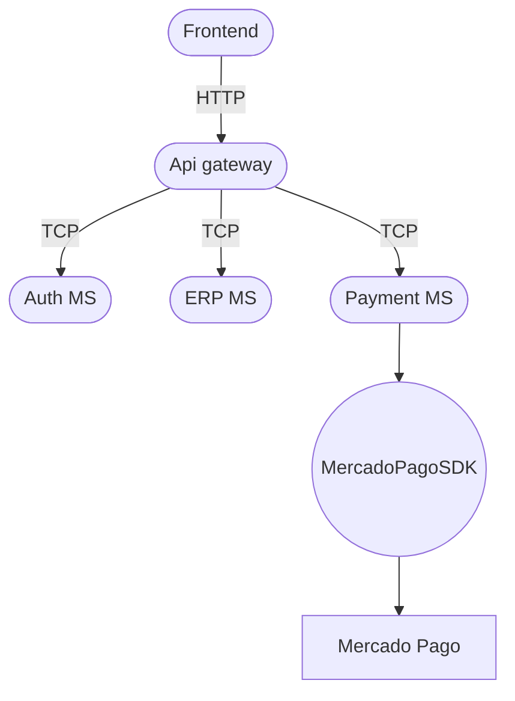

# Trabajo Final - ERP para pymes

## Informacion (Grupo 148)

**Integrantes**

- Lautaro Zullo
- Lucas Gragera
- Galo Coria Maiorano

**Profesor**

- Sebastian Bruselario

29 de Agosto de 2026

## Índice

 [Documentación](#documentación)
   - [Información inicial](#información-inicial)
     - [Problema a Resolver](#problema-a-resolver)
     - [Solución Propuesta](#solución-propuesta)
   - [Arquitectura y tecnologías](#arquitectura-y-tecnologías)
   - [Estructura del repositorio](#estructura-del-repositorio)

---

## Documentación

### Información inicial

#### Problema a Resolver

- La fragmentación operativa en pequeños comercios y PyMEs genera cuellos de botella significativos en su gestión diaria

- La carencia de un sistema unificado para:
  - el control de stock de productos 
  - el registro concurrente de ventas y la emisión de comprobantes de pago resulta en inconsistencias de stock
  - pérdida de tiempo productivo en tareas manuales y una visibilidad financiera deficiente, lo que obstaculiza la toma de decisiones estratégicas

#### Solución Propuesta

Desarrollo e implementación de una plataforma web integral (ERP) orientada a la gestión empresarial. Este sistema centralizará la administración del stock de productos, la operatoria de punto de venta (POS) y la analítica financiera, proporcionando una herramienta robusta, escalable y con procesamiento en tiempo real para optimizar los flujos de trabajo del negocio.

### Arquitectura y tecnologías

El backend se organiza en **microservicios NestJS** (Auth, ERP y Payments) comunicados por TCP detrás de un **API Gateway**, que es el único punto expuesto al exterior. Cada microservicio tiene su propia base de datos PostgreSQL, a la que accede mediante Prisma. El frontend es una aplicación **Angular** que consume el Gateway por HTTP. Los pagos se procesan con el SDK oficial de Mercado Pago.

```mermaid
flowchart TD
    Frontend([Frontend]) -->|HTTP| Gateway([Api gateway])
    Gateway -->|TCP| Auth([Auth MS])
    Gateway -->|TCP| ERP([ERP MS])
    Gateway -->|TCP| Payment([Payment MS])
    Payment --> MercadoPagoSDK((MercadoPagoSDK))
    MercadoPagoSDK --> MP[Mercado Pago]
```

**Tecnologías:** NestJS · TypeScript · PostgreSQL · Prisma · Angular · Mercado Pago SDK · Docker

| Documento | Contenido |
|---|---|
| [Arquitectura](docs/arquitectura.md) | Estilo arquitectónico, tecnologías definitivas y justificación de cada decisión |
| [Listado de módulos](docs/modulos.md) | Módulos funcionales con descripción, prioridad y orden de implementación |
| [Requerimientos](docs/requerimientos.md) | Requerimientos funcionales y no funcionales |
| [Reglas de negocio](docs/reglas-de-negocio.md) | Reglas de catálogo, stock, ventas, pagos y permisos |
| [Modelo relacional](docs/modelo-relacional.md) | Modelo de datos por microservicio y decisiones de diseño |
| [Base de datos](database/README.md) | Scripts DDL y datos de prueba (DML) por servicio |

### Estructura del repositorio

| Carpeta | Contenido |
|---|---|
| [`docs/`](docs/) | Documentación del proyecto: arquitectura, módulos, requerimientos, reglas de negocio y modelo de datos (con el [diagrama entidad-relación](docs/der.png)) |
| [`database/`](database/) | Scripts DDL y datos de prueba (DML) por microservicio; ver su [README](database/README.md) |
| `Backend/` | Monorepo NestJS: `apps/gateway`, `apps/auth`, `apps/erp`, `apps/payments` (estructura inicial, sin código) |
| `Frontend/` | Aplicación Angular: `src/app/core`, `src/app/inventory`, `src/app/sales-payments` (estructura inicial, sin código) |
