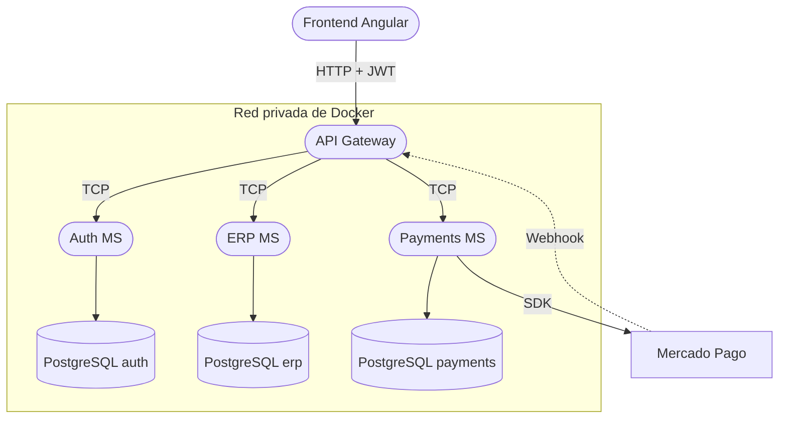

# Arquitectura — ERP para PyMEs

Descripción de la arquitectura elegida, las tecnologías definitivas y la justificación de cada decisión técnica.

## 1. Estilo arquitectónico

El sistema combina tres decisiones:

- **Microservicios** en el backend: Auth, ERP y Payments, cada uno desplegable y escalable de forma independiente (RNF-01, RNF-07).
- **API Gateway** como único punto de entrada: el frontend nunca se comunica directamente con un microservicio.
- **Arquitectura en capas** dentro de cada microservicio (controladores, servicios, repositorios).



## 2. Tecnologías definitivas

| Capa | Tecnología | Justificación |
|---|---|---|
| Backend | NestJS 11 + TypeScript (modo estricto) | Soporte nativo de microservicios (`@nestjs/microservices`) y una estructura modular que ordena el código por dominio. |
| Organización del código | Monorepo de Nest CLI (`apps/` + `libs/`) con pnpm | Los cuatro servicios comparten DTOs y configuración desde `libs/` sin publicar paquetes aparte. |
| Comunicación interna | TCP (`@nestjs/microservices`) | Aísla los microservicios y reduce la superficie de exposición: solo el Gateway habla HTTP hacia afuera. |
| Base de datos | PostgreSQL | Priorizado sobre MySQL por su compatibilidad con las herramientas del ecosistema, tipos enumerados nativos y restricciones `CHECK` completas. |
| ORM | Prisma 7 | Integración con NestJS, tipado generado a partir del esquema, migraciones versionadas y experiencia previa del equipo. |
| Autenticación | Usuario y contraseña + JWT | Sesiones sin estado: el Gateway valida el token sin consultar al Auth MS en cada petición. |
| Pagos | SDK oficial de Mercado Pago para Node.js | Evita implementar a mano las llamadas HTTP a la API; el backend se autentica con el Access Token privado de la aplicación. |
| Frontend | Angular 22 | Framework estructurado cuya organización modular es muy similar a la de NestJS, lo que acelera el desarrollo del equipo. |
| Infraestructura | Docker | Red privada para los microservicios; solo el Gateway expone un puerto al exterior (RNF-02). |

> Documentación oficial: [NestJS](https://docs.nestjs.com/) · [Microservicios con NestJS](https://docs.nestjs.com/microservices/basics) · [Prisma con PostgreSQL](https://www.prisma.io/docs/prisma-orm/quickstart/prisma-postgres) · [SDK de Mercado Pago](https://www.mercadopago.com.ar/developers/es/docs/sdks-library/overview) · [Angular](https://angular.dev/overview)

## 3. Backend

### 3.1 Microservicios

| Servicio | Responsabilidad | Expuesto |
|---|---|---|
| **API Gateway** | Recibe las peticiones HTTP del frontend, valida el JWT y las enruta al microservicio correspondiente. Recibe también el webhook de Mercado Pago. | Sí (HTTP) |
| **Auth MS** | Autenticación, emisión de JWT, gestión de usuarios y roles. | No (TCP) |
| **ERP MS** | Núcleo del sistema: catálogo, movimientos de stock y ventas (POS). | No (TCP) |
| **Payments MS** | Procesamiento y seguimiento de pagos con Mercado Pago. | No (TCP) |

### 3.2 Estructura interna y capas

Cada microservicio adopta una arquitectura en capas:

- **Controladores (Controllers):** reciben y responden las peticiones (HTTP en el Gateway, mensajes TCP en el resto).
- **Servicios (Services):** procesan la lógica de negocio de cada módulo.
- **Repositorios (Repositories):** encapsulan la interacción con la base de datos a través de Prisma.

### 3.3 Persistencia: una base de datos por servicio

Cada microservicio es dueño exclusivo de su propia base de datos PostgreSQL (*database-per-service*). No existen claves foráneas entre servicios: las referencias cruzadas (por ejemplo, `sales.user_id` hacia `users` o `payments.sale_id` hacia `sales`) son lógicas y se validan en la capa de servicio (RNF-04).

Así ningún servicio puede leer ni modificar los datos de otro sin pasar por su interfaz, y cada uno puede evolucionar su esquema de forma independiente.

- Modelo de datos completo: [modelo relacional](./modelo-relacional.md).
- Scripts DDL y datos de prueba: carpeta [`database/`](../database/README.md).

### 3.4 Autenticación

El registro y el inicio de sesión usan autenticación tradicional con usuario y contraseña; las contraseñas se almacenan hasheadas (RNF-06). Las sesiones se manejan con JWT: el Auth MS emite el token y el Gateway lo valida en cada petición antes de enrutarla.

### 3.5 Pasarela de pagos

El Payments MS usa el SDK oficial de Mercado Pago para Node.js. El cambio de estado de un pago (`Pending` → `Paid`/`Rejected`) lo dispara la notificación (webhook) de Mercado Pago, no una acción manual (RN-15).

## 4. Frontend

La interfaz se desarrolla en Angular y se organiza en tres módulos independientes (ver [listado de módulos](./modulos.md)):

- **Core y Auth:** control de acceso, sesiones, roles de usuario y protección de rutas.
- **Inventario:** gestión y consulta del catálogo mediante tablas de stock dinámicas.
- **Ventas y Pagos:** carrito de compras, procesamiento de ventas y cobros mediante formularios reactivos.

Los módulos se cargan con **lazy loading**: no se descargan todos al inicio, sino bajo demanda, lo que mejora el tiempo de carga inicial. Toda la comunicación con el backend se hace por HTTP contra el API Gateway.

## 5. Estructura del repositorio

La estructura de carpetas refleja la arquitectura:

```text
/
├── Backend/            Monorepo NestJS
│   └── apps/
│       ├── gateway/    API Gateway (HTTP)
│       ├── auth/       Auth MS (TCP)
│       ├── erp/        ERP MS (TCP)
│       └── payments/   Payments MS (TCP)
├── Frontend/           Aplicación Angular
│   └── src/app/
│       ├── core/            Core y Auth
│       ├── inventory/       Inventario
│       └── sales-payments/  Ventas y Pagos
├── database/           DDL y datos de prueba por servicio
└── docs/               Requerimientos, reglas de negocio, modelo de datos, módulos y arquitectura
```

## 🔗 Relacionado

- [Listado de módulos](./modulos.md)
- [Requerimientos](./requerimientos.md)
- [Reglas de negocio](./reglas-de-negocio.md)
- [Modelo relacional](./modelo-relacional.md)
