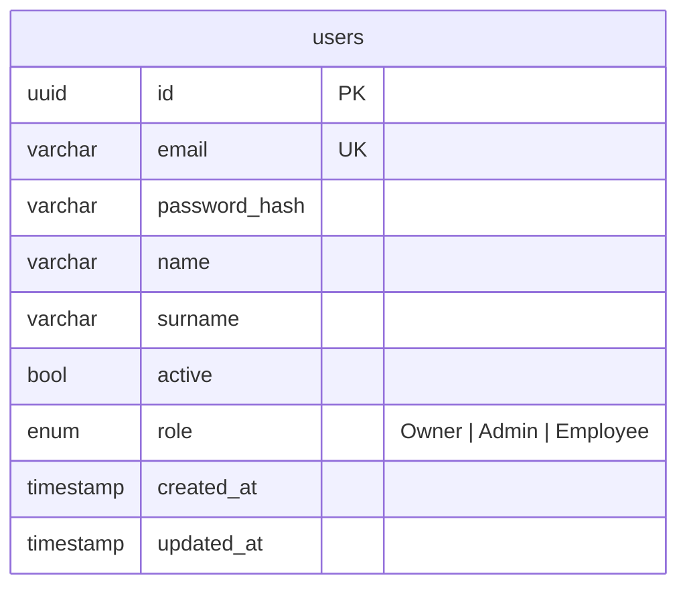
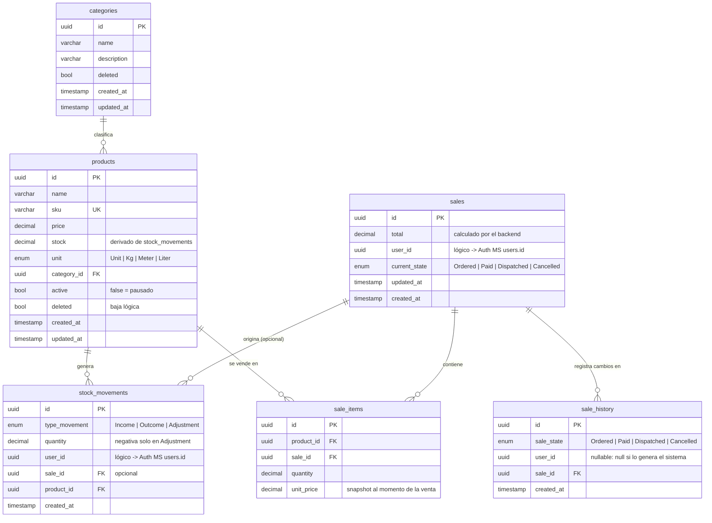
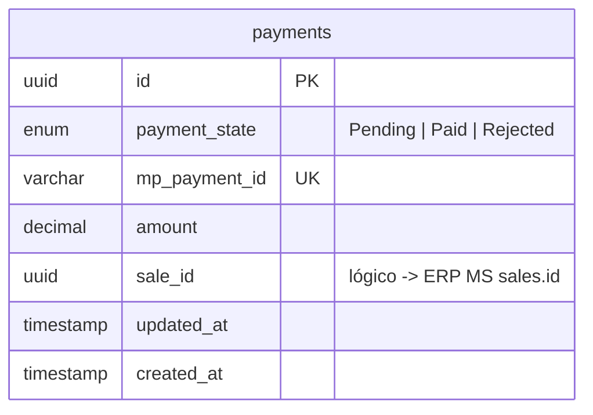

# Modelo Relacional — ERP para PyMEs

> Motor: PostgreSQL. ORM: Prisma `7.10.0`. Una base de datos por microservicio (Auth, ERP, Payments) — **sin claves foráneas entre servicios**, por diseño (ver [reglas de negocio, RN-18](./reglas-de-negocio.md#5-integridad-entre-microservicios)).
>
> Diagrama interactivo: [Tesis en dbdiagram.io](https://dbdiagram.io/d/Tesis-6ab14a9c9ba2420e18d18221)

## 1. Auth MS



## 2. ERP MS



## 3. Payments MS



## 4. Decisiones de diseño

- **Referencias cruzadas entre servicios sin FK.** `user_id` (en `sales`, `stock_movements`, `sale_history`) apunta lógicamente a `users.id` de Auth MS, y `payments.sale_id` a `sales.id` de ERP MS. Una FK entre bases distintas no puede existir en PostgreSQL; la integridad se valida en el servicio (ver RN-18).
- **Desnormalización intencional** (debe actualizarse siempre dentro de la misma transacción que la origina):
  - `products.stock` deriva de `stock_movements` (RN-01).
  - `sales.current_state` duplica el último registro de `sale_history`.
  - `sales.total` es un snapshot calculado por el backend, nunca aceptado del cliente (RN-06).
- **Snapshot de precio:** `sale_items.unit_price` congela el precio al momento de la venta (RN-07).
- **Cantidades decimales:** `quantity`/`stock` son `decimal(12,3)`; `products.unit` indica si el producto es fraccionable. El backend valida que solo `Kg`/`Meter`/`Liter` acepten decimales (RN-05). Soportar productos por peso/longitud es una decisión de diseño del equipo, no un requerimiento documentado originalmente en el alcance académico.
- **`products.active` vs. `deleted`:** ver RN-04.
- **`sale_history.user_id` nullable:** ver RN-10.
- **Sin entidad cliente:** ver RN-12.
- **`stock_movements.sale_id` nullable:** permite rastrear qué venta generó cada `Outcome` y revertirlo si se cancela (RN-11). Relación opcional (`ref: >?` en DBML).
- **Convención de signo en `Adjustment`:** ver RN-03.
- **`current_state` no valida transiciones a nivel de base de datos:** el enum `sale_states` permite cualquier valor, pero la máquina de estados (`Ordered` → `Paid` → `Dispatched`, cancelable solo antes de `Dispatched`) se valida en el servicio, no con un `CHECK` — ver RN-09/RN-09.1.
- **Unicidad del rol `Owner`:** el sistema admite un solo usuario `Owner` (RN-16.1). No puede resolverse con un `unique` sobre `role` — impediría tener más de un `Employee` —, sino con un índice único parcial (`WHERE role = 'Owner'`), que se agrega editando el SQL de la migración.

## 5. Esquema completo (DBML)

Utilizamos la herramienta dbdiagram.io para poder visualizar nuestro DBML

- [visualizador de DBML](https://dbdiagram.io/d/Tesis-6ab14a9c9ba2420e18d18221)

```dbml
// ===================== Auth MS =====================
Enum roles {
  Owner
  Admin
  Employee
}

Table users {
  id uuid [pk, not null]
  email varchar [not null, unique]
  password_hash varchar [not null]
  name varchar [not null]
  surname varchar
  active bool [not null, default: true]
  role roles [not null, default: 'Employee']
  created_at timestamp [not null, default: `now()`]
  updated_at timestamp [not null, default: `now()`]

  // Single-Owner constraint (RN-16.1) requires a PARTIAL unique index,
  // not expressible in DBML. Added in the migration SQL:
  // CREATE UNIQUE INDEX uq_users_single_owner ON users (role) WHERE role = 'Owner';
}

// ===================== ERP MS =====================
Enum product_units {
  Unit
  Kg
  Meter
  Liter
}

Table categories {
  id uuid [pk, not null]
  name varchar [not null]
  description varchar
  deleted bool [not null, default: false] // logical delete
  created_at timestamp [not null, default: `now()`]
  updated_at timestamp [not null, default: `now()`]
}

Table products {
  id uuid [pk, not null]
  name varchar [not null]
  sku varchar [not null, unique]
  price decimal(12,2) [not null]
  // Derived from stock_movements; kept here for fast reads.
  stock decimal(12,3) [not null, default: 0]
  unit product_units [not null, default: 'Unit']
  category_id uuid [ref: > categories.id, not null]
  active bool [not null, default: true]   // false = paused for sale
  deleted bool [not null, default: false] // logical delete
  created_at timestamp [not null, default: `now()`]
  updated_at timestamp [not null, default: `now()`]

  indexes {
    category_id
  }

  checks {
    `stock >= 0` [name: 'chk_products_stock_non_negative']
    `price >= 0` [name: 'chk_products_price_non_negative']
  }
}

Enum type_movements {
  Income
  Outcome
  Adjustment
}

Table stock_movements {
  id uuid [pk, not null]
  type_movement type_movements [not null]
  // Income/Outcome always positive; only Adjustment may be negative
  quantity decimal(12,3) [not null]
  // Logical reference to Auth MS users.id (cross-service, no FK)
  user_id uuid [not null]
  // Set when the movement was generated by a sale
  sale_id uuid [ref: >? sales.id, null]
  product_id uuid [ref: > products.id, not null]
  created_at timestamp [not null, default: `now()`]

  indexes {
    (product_id, created_at) // history of a product, ordered by date
    sale_id                  // movements generated by a sale
  }

  checks {
    `type_movement = 'Adjustment' OR quantity > 0` [name: 'chk_stock_movements_quantity_sign']
  }
}

Enum sale_states {
  Ordered
  Paid
  Dispatched
  Cancelled
}

Table sales {
  id uuid [pk, not null]
  total decimal(12,2) [not null]
  // Logical reference to Auth MS users.id (cross-service, no FK)
  user_id uuid [not null]
  current_state sale_states [not null]
  updated_at timestamp [not null, default: `now()`]
  created_at timestamp [not null, default: `now()`]

  indexes {
    created_at                  // date-range reports
    (current_state, created_at) // pending sales screens
    user_id                     // sales per employee
  }

  checks {
    `total >= 0` [name: 'chk_sales_total_non_negative']
  }
}

Table sale_items {
  id uuid [pk, not null]
  product_id uuid [ref: > products.id, not null]
  sale_id uuid [ref: > sales.id, not null]
  quantity decimal(12,3) [not null]
  // Price snapshot at the moment of sale
  unit_price decimal(12,2) [not null]

  indexes {
    (sale_id, product_id) [unique] // no duplicate lines; also serves lookups by sale_id
    product_id                     // sales-per-product reports
  }

  checks {
    `quantity > 0`    [name: 'chk_sale_items_quantity_positive']
    `unit_price >= 0` [name: 'chk_sale_items_price_non_negative']
  }
}

Table sale_history {
  id uuid [pk, not null]
  sale_state sale_states [not null]
  // Logical reference to Auth MS users.id (cross-service, no FK).
  // Null when the change was made by the system (e.g. payment webhook).
  user_id uuid [null]
  sale_id uuid [ref: > sales.id, not null]
  created_at timestamp [not null, default: `now()`]

  indexes {
    (sale_id, created_at) // state timeline of a sale
  }
}

// ===================== Payments MS =====================
Enum payment_states {
  Pending
  Paid
  Rejected
}

Table payments {
  id uuid [pk, not null]
  payment_state payment_states [not null, default: 'Pending']
  mp_payment_id varchar [unique]
  amount decimal(12,2) [not null]
  // Logical reference to ERP MS sales.id (cross-service, no FK)
  sale_id uuid [not null]
  updated_at timestamp [not null, default: `now()`]
  created_at timestamp [not null, default: `now()`]

  indexes {
    sale_id // payments of a sale
  }

  checks {
    `amount > 0` [name: 'chk_payments_amount_positive']
  }
}
```

## 🔗 Relacionado

- [Requerimientos del sistema](./requerimientos.md)
- [Reglas de negocio](./reglas-de-negocio.md)
