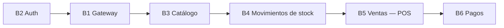

# Listado de Módulos — ERP para PyMEs

Enumeración de los módulos funcionales que desarrollará el equipo, con su descripción, el microservicio o capa que los implementa y su prioridad. El detalle de cada módulo (requerimientos y criterios de aceptación) está en [requerimientos](./requerimientos.md).

## Criterio de prioridad

| Prioridad | Significado                                                                                                                                |
| --------- | ------------------------------------------------------------------------------------------------------------------------------------------ |
| **Alta**  | Sin este módulo no existe un producto mínimo viable: el sistema no resuelve el problema planteado (control de stock y registro de ventas). |
| **Media** | Completa el flujo de negocio, pero el núcleo del sistema funciona y puede demostrarse sin él.                                              |
| **Baja**  | Mejora o extensión; se implementa solo si el resto está terminado.                                                                         |

## Módulos de backend

| #   | Módulo                   | Microservicio | Descripción                                                                                                                                                           | Requerimientos        | Prioridad |
| --- | ------------------------ | ------------- | --------------------------------------------------------------------------------------------------------------------------------------------------------------------- | --------------------- | --------- |
| B1  | API Gateway              | Gateway       | Único punto de entrada HTTP del sistema. Valida el JWT de cada petición y la enruta por TCP al microservicio correspondiente.                                         | RF-03, RNF-01, RNF-02 | Alta      |
| B2  | Autenticación y usuarios | Auth MS       | Registro de arranque del `Owner`, inicio de sesión con emisión de JWT, alta de usuarios por `Owner`/`Admin`, cambio de rol y desactivación de usuarios.               | RF-01 a RF-05         | Alta      |
| B3  | Inventario — Catálogo    | ERP MS        | ABM de categorías y productos (SKU único, precio, unidad de medida), pausa y baja lógica de productos.                                                                | RF-06 a RF-10         | Alta      |
| B4  | Movimientos de stock     | ERP MS        | Registro de todo cambio de stock como movimiento (`Income`, `Outcome`, `Adjustment`), historial por producto y bloqueo de stock negativo.                             | RF-11 a RF-13         | Alta      |
| B5  | Ventas — POS             | ERP MS        | Carga de ventas con uno o más ítems, cálculo del total en el backend, precio congelado por ítem, ciclo de estados con historial y cancelación con reversión de stock. | RF-14 a RF-19         | Alta      |
| B6  | Pagos                    | Payments MS   | Inicio de cobros con el SDK de Mercado Pago, actualización del estado del pago por webhook y reflejo del resultado en la venta.                                       | RF-20 a RF-22         | Media     |

## Módulos de frontend

| #   | Módulo         | Descripción                                                                                                         | Requerimientos | Prioridad                                      |
| --- | -------------- | ------------------------------------------------------------------------------------------------------------------- | -------------- | ---------------------------------------------- |
| F1  | Core y Auth    | Login, manejo de sesión, protección de rutas según rol e interceptor que adjunta el JWT a cada petición al Gateway. | RF-23          | Alta                                           |
| F2  | Inventario     | Listado y gestión del catálogo mediante tablas de stock dinámicas; carga de movimientos de stock.                   | RF-24          | Alta                                           |
| F3  | Ventas y Pagos | Carrito de compras, carga de la venta y cobro mediante formularios reactivos.                                       | RF-25          | Alta (ventas) / Media (cobro con Mercado Pago) |

## Orden de implementación

El orden surge de las dependencias entre módulos: ninguno puede probarse de punta a punta si el anterior no existe.

1. **B2 Auth + B1 Gateway:** todo el resto de los endpoints exige un JWT válido (RF-03).
2. **B3 Catálogo:** los movimientos y las ventas referencian productos.
3. **B4 Movimientos de stock:** una venta genera un movimiento `Outcome` (RF-18).
4. **B5 Ventas — POS:** un pago siempre se origina desde una venta existente (RN-13).
5. **B6 Pagos:** cierra el ciclo `Ordered` → `Paid`.

Los módulos de frontend se desarrollan en paralelo, cada uno detrás del módulo de backend que consume (F1 con B1/B2, F2 con B3/B4, F3 con B5/B6).

## 🔗 Relacionado

- [Requerimientos](./requerimientos.md)
- [Arquitectura](./arquitectura.md)
- [Reglas de negocio](./reglas-de-negocio.md)
